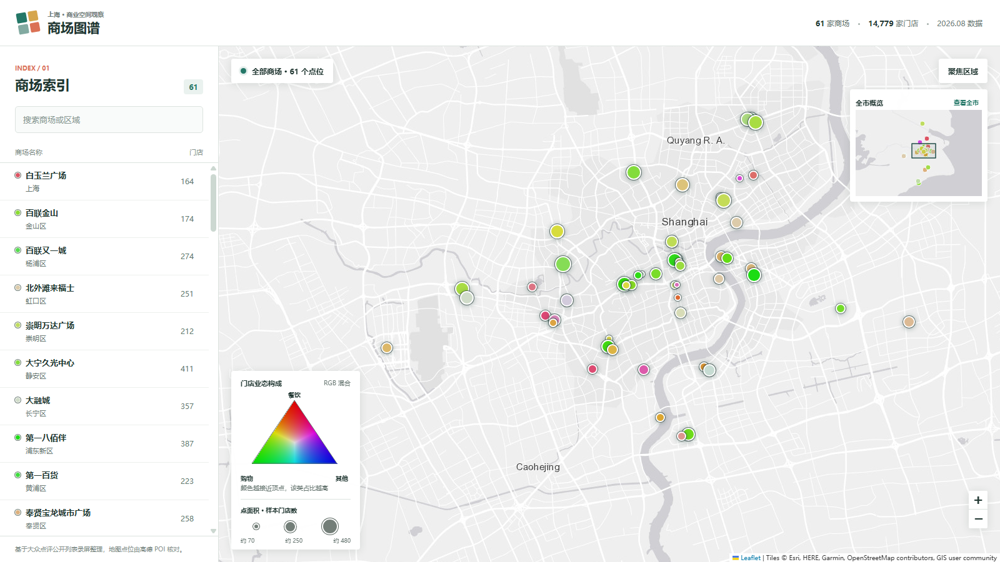

# 上海购物中心消费生态结构分析报告

> 数据截面：61 家商场、14779 个店铺实例、7803 个品牌，采集自大众点评公开门店列表（2026-08）。
> 本报告为阶段性结果。样本尚未覆盖全市各区，所有涉及地理分布的结论需结合覆盖范围解读。
> 交互地图见 [上海商场图谱](../map/index.html)；本报告保留地图观察的截图、数据检验和补充分析。

## 摘要

不预设商场类型，从地图中的直观观察出发，再用门店构成数据核验：

1. **样本内门店数较多的商场更偏购物，较少的更偏美食。**地图点的大小与颜色让这一趋势浮现；
   门店数与购物占比的 Pearson 相关为 +0.475，与美食占比为 -0.489。"其他"通常不是明显优势，
   但有 2 家商场以它为三类中的最高占比。门店数是采集到的实例数，不是建筑面积（见 §2.1）。
2. **商场业态结构呈连续变化，难以分出清晰的离散类型。**业态构成呈强嵌套性
   （r = −0.886，等规模稀释控制后仍为 −0.638）：业态多的商场并非"换了一套业态"，
   而是在所有商场共有的核心之上叠加稀有业态。K-Means 最佳轮廓系数仅 0.320，
   与嵌套结构的预期一致。
3. **品牌层面几乎完全不重叠，业态结构层面高度雷同。**品牌 Jaccard 相似度均值 0.040，
   而二级业态占比余弦相似度均值 0.723。该对比在三种品牌身份定义与两种单例处理下
   均成立（Jaccard 区间 0.040–0.045，见 §2.3），因此对命名归一化不敏感。
   "千店一面"在品牌层面不成立，在结构层面成立。
4. **年轻化（亚文化业态占比）是一个独立维度。**它与门店数的边际相关接近零
   （r = +0.052），与正餐客单价的回归系数较小；多变量关系见 §2.5。



*图 1. 2026-10-07 截取的当前地图；底层商户数据截面为 2026-08。中央密集区域有点位遮挡，
颜色和大小用于提出观察，结论以全部 61 家商场的原始指标检验（见 §2.1）。*

---

## 一、方法

### 1.1 数据链

```
大众点评列表页录屏 → PaddleOCR 卡片识别 → merchant_cards.csv（每商场一份，只读）
                  → 排除/分类/去重 → master_stores.csv（统一主表）
                  → 特征构建 → mall_profiles.csv → 地图与结构分析
```

OCR 输出被视为不可变原始数据，所有清洗只发生在汇总层，因此任何规则变更都可从同一批
OCR 输出重建，无需重跑识别。`run_manifest.json` 记录输入文件 SHA-256 与完整配置快照。

### 1.2 地图编码与第一个观察的口径

地图圆点的面积编码商场内**采集到的门店实例数**，颜色按一级分类的门店占比混合：
美食为红色、购物为绿色，其余类别为蓝色。三个通道均除以该商场的最大占比后再着色，
所以颜色表达的是三类之间的相对构成，不能从色彩亮度读出绝对占比。
"其他"合并丽人美发、休闲玩乐、运动健身、生活服务、教育培训和亲子，
并非一种独立业态。聚合点按所含商场的占比等权混色，数字为商场数；
本报告的相关性和分组统计均以**单家商场**为单位，不使用聚合点。

### 1.3 特征维度

六个进入分析的维度，彼此最强偏相关 −0.654：

| 维度 | 定义 | 样本无关性 |
|---|---|---|
| 标准化程度 | 留一法期望共现率 | 已改造 |
| 独有品牌率 | 仅出现于 1 家商场的品牌门店占比 | 样本内 |
| 功能稀有度 | 所含二级业态的平均 −log(普遍度)，留一 | 已改造 |
| 正餐客单价 | 正餐子集中位数（截尾 20–1000 元），对数化 | 天然无关 |
| 亚文化指数 | 潮玩礼品、桌游棋牌、VR体验、游戏电竞、密室逃脱、DIY手工、演出活动 | 天然无关 |
| 体验型占比 | 需到店消费的业态占比 | 天然无关 |

**已废弃的指标及原因：**

- *样本内共现占比*：随样本量单调漂移。N 从 61 缩到 12 时漂移 −0.227、秩相关降至 0.644；
  改用留一法后漂移始终在 ±0.008 内、秩相关 0.925。
- *人工连锁率*：人工名单仅 12 个品牌，全部商场落在 0–9%，无信息量。
- *头部连锁率*：与标准化程度相关 0.973，属同一构念的两种算法，同时纳入会重复计权。
- *全餐饮均价*：奶茶店多的商场被系统性拉低；餐饮价格分布在 60 元处双峰，
  饮品小吃组（茶饮 20、咖啡 31、面包 36）与正餐组（湘菜 67 至烧烤 121）需分离。
- *平均评分*：商场间均值极差 0.41，小于组内标准差 0.46，无判别力。
- *业态广度*：与功能稀有度相关 0.81、与门店数相关 0.73，冗余且受规模驱动。

### 1.4 门店状态不作为存在性判据

早期配置排除两类门店，现已改为保留并记录为状态变量（`rating_state`、`is_new_store`）：

- **明确"暂无评分"**：1092 条
- **"新店"标记**：686 条

改动原因是排除并非随机。以仅因这两条规则被排除、且分类可映射的 1780 条记录计算，
各业态损失率相差 9 倍：

| 业态 | 损失率 | | 业态 | 损失率 |
|---|---:|---|---|---:|
| 游戏电竞 | 24.3% | | 手表腕表 | 16.5% |
| 演出活动 | 23.7% | | 粤菜 | 4.1% |
| 撸宠购宠 | 21.9% | | 电影院 | 4.1% |
| DIY 手工 | 19.4% | | **奢侈品** | **2.6%** |

评分缺失是数据属性而非商户属性，新店是经营阶段而非排除理由；两者都会系统性低估
新兴业态与年轻化指标。恢复后主表从 13001 增至 14779 条（+1778），零实例丢失。

对亚文化指数的实际影响：各商场平均绝对变动 0.52 个百分点，最大 +2.7（世贸广场）
至 −2.1（百联金山），改动前后秩相关 0.980。**排序稳健，但绝对值此前系统性偏低。**

排除开关保留在配置中，可用于敏感性对比，默认关闭。

### 1.5 年轻化指标的构造与修正

初版将 9 个业态等权相加，但内部一致性检验不通过：成分间平均两两相关仅 +0.102，
PCA 第一主成分只解释 24.8%（若为单一构念应超过 50%）。且茶饮果汁与潮玩礼品两项
占指标权重七成，美甲美睫占 12.7% 却与总指标相关仅 +0.09。

据此拆分为两个独立指标（相关 +0.06）：

- **亚文化指数**（7 类，见上表）
- **轻消费指数**（茶饮果汁、美甲美睫、撸宠购宠）

拆分的判据不是主观赋值，而是从共址结构导出：以五个无争议的年轻业态为锚，
计算其他业态与锚指标的共址相关性，得到一个连续的"年龄倾向谱"——
潮玩礼品 +0.93、电竞 +0.38、密室 +0.37、DIY +0.33、演出 +0.32、火锅 +0.32、
茶饮 +0.27、烧烤 +0.23，至美甲 −0.15、美发 −0.28、奢侈品 −0.29。

咖啡（−0.11）与面包甜点（+0.03）因无年轻化指向而排除。加权方案经检验与等权方案
秩相关 0.79–0.99，收益小而主观性大，故采用等权 + 分离而非加权。

---

## 二、发现

### 2.1 地图观察：门店数与购物、美食构成

地图上较大的点往往更偏绿，较小的点较常偏红；同时很少看到接近图例蓝色顶点的点。
这引出两个问题：门店数与购物、美食占比是否存在整体关系？"其他"是否真的从不占优？

| 检验：61 家商场，逐家计算 | 结果 |
|---|---:|
| 门店实例数范围 | 72–484 家 |
| 门店数与购物占比的 Pearson / Spearman 相关 | +0.475 / +0.453 |
| 门店数与美食占比的 Pearson / Spearman 相关 | -0.489 / -0.516 |
| 门店数较少的 30 家：购物 / 美食占比中位数 | 35.0% / 43.1% |
| 门店数较多的 31 家：购物 / 美食占比中位数 | 43.7% / 33.2% |

这支持**样本内的总体趋势**，并不意味着每家门店较多的商场都更偏购物。
上述两类占比以同一商场门店数为分母，三类占比之和固定为 1；两条相关性不能当作
相互独立的效应，也不能证明商场面积或经营策略造成了这种构成。

"其他"并非没有最高占比：31 家以购物为三类中最高，28 家以美食为最高，2 家以其他为最高。

| 例外商场 | 门店实例 | 购物 | 美食 | 其他 |
|---|---:|---:|---:|---:|
| 正大乐城 | 108 | 13.9% | 41.7% | 44.4% |
| 长宁来福士 | 302 | 32.1% | 33.1% | 34.8% |

两家的"其他"只是略高于美食。按地图的 RGB 混色规则，它们分别趋向紫色和浅色，
不会显示为鲜明的蓝点。因此视觉观察应写成**"没有明显由其他类别单独主导的蓝色商场"**，
而不是"不存在其他占比最高的商场"。

**解释边界。**点面积反映当前采集到的店铺实例数，不等于商场建筑面积、营业面积或客流。
大众点评收录、OCR 漏检、分类与去重规则、样本选择都会影响门店数及占比；
当前 61 家也不是上海全部商场的随机样本。这是一项从地图发现、再用同一批数据核验的
探索性观察，不是对全市商场或因果机制的证明。

### 2.2 结构是连续的，不是分化的

```
corr(业态多样性, 所含业态平均普遍度) = -0.886
等规模稀释至 72 店后（30 次重复）    = -0.638 (sd 0.070)
```

强负相关意味着**嵌套结构**：业态多的商场包含业态少的商场所有的业态，并额外叠加稀有业态。
恒隆广场 24 个二级业态、平均普遍度 53.1；上海环球港 61 个、平均普遍度 43.2——
前者近似是后者的子集，反之不成立。

由于门店数与多样性天然正相关（r = 0.735），必须排除规模假象。将每家商场随机稀释到
相同门店数（72 家）后重算 30 次，相关性减弱但仍达 −0.638，**说明嵌套性不是规模驱动的假象**。

### 2.3 品牌不重叠，结构却雷同

| 口径 | 均值 | 最大值 |
|---|---:|---:|
| 品牌集合 Jaccard 相似度 | 0.040 | 0.167 |
| 二级业态占比余弦相似度 | 0.723 | — |

同一批商场、1830 个两两组合，两种口径给出相反图景：**每家商场的招牌都不一样，骨架都一样**。
两者相差 16.1 倍。这为"千店一面"提供了可计算的表述——该现象在品牌层面是错的，
在业态结构层面是对的。

**敏感性检验（重要）。**74.8% 的品牌只出现在一家商场。这个比例不能直接解读为商业独特性，
因为它同时包含中英文名未统一（如 `Dior迪奥` / `Dior彩妆香氛` / `DIOR迪奥咖啡馆`）、
OCR 名称碎片、样本只覆盖到该品牌一个门店、以及点评收录差异。实测拉丁字母主干相同的
品牌名共有 223 组潜在重复。

为界定结论的稳健区间，在三种品牌身份定义 × 两种单例处理下重算（`brand_sensitivity.py`）：

| 品牌身份定义 | 单例处理 | 品牌数 | 单例占比 | Jaccard 均值 |
|---|---|---:|---:|---:|
| 现行（完整名） | 保留全部 | 7803 | 74.8% | 0.0399 |
| 现行 | 剔除弱证据单例 | 7325 | 73.1% | 0.0413 |
| 拉丁主干合并 | 保留全部 | 7435 | 72.8% | 0.0424 |
| 拉丁主干合并 | 剔除弱证据单例 | 6985 | 71.0% | 0.0438 |
| 主干+去店型后缀 | 保留全部 | 7388 | 72.5% | 0.0436 |
| 主干+去店型后缀 | 剔除弱证据单例 | 6941 | 70.7% | 0.0450 |

（弱证据单例 = 仅出现于 1 家商场且全程仅被观察到 1 次；必须在每种品牌身份定义下
重新识别，三种口径分别为 478、450、447 个。）

**结论：Jaccard 均值在所有组合下落在 0.040–0.045，与业态结构余弦 0.723 相差一个数量级。
"品牌不重叠、结构雷同"的对比对品牌身份定义不敏感。**但需明确：单例品牌比例本身
（74.8%）受命名统一程度与样本覆盖度影响，**不应单独作为"商业独特性"的度量**。
本报告中 §2.4 的独有品牌率维度同样受此影响，解释时须一并考虑。

### 2.4 三种极端模式与连续混合

原型分析（archetypal analysis）在数据云的凸包内取 3 个端元，每家商场表示为端元的
凸组合。算法同时约束商场权重与原型权重非负且和为 1，因此原型不会越过观测数据外推。
解释方差 60.1%。

| 原型 | 画像（标准化后） | 最接近的商场 |
|---|---|---|
| **A0 标准化型** | 标准化 +1.13、独有品牌 −0.86、客单价 −0.75 | 百联金山、奉贤龙湖天街、崇明万达、虹口凯德龙之梦、万达茂 |
| **A1 功能体验型** | 亚文化 +2.51、体验型 +2.23、独有品牌 +1.51、功能稀有 +1.15 | 世贸广场、瑞虹天地月亮湾、静安大悦城、第一百货、世博源 |
| **A2 高价低标准化型** | 客单价 +1.98、标准化 −1.94、功能稀有 −1.55、体验型 −1.53 | 上海恒隆广场、西岸梦中心、静安嘉里中心、国金 ifc、中信泰富 |

以最大权重 0.6 为任意描述阈值，44/61 接近某一端元，17/61 为明显混合型。该数字
**不能当作聚类证据**：原型权重是连续坐标，而且 0.6 阈值没有统计学分界。修复前的算法
把原型更新成无约束最小二乘解，9 个坐标越过样本极值，并错误地产生“49/61 为混合型”
这一结论；该结论现已撤回。是否存在离散簇应由 K-Means 与 Aitchison 距离检验判断。

作为对照，K-Means 在同一特征空间上的最佳轮廓系数为 0.320（k=3），
k=2 至 k=6 全部落在 0.254–0.320。**离散分型不成立**，此结果作为反面证据报告。

原型划分不等于高低端分层：A1 中第一百货与世博源、金山万达并列，客单价差异显著，
共同点是"独有品牌多 + 体验型业态多 + 功能稀有"这一组结构特征。

### 2.5 年轻化是独立维度

亚文化指数区间 0.0%（恒隆）至 24.8%（世贸广场），七维回归 R² = 0.479（调整后 0.410）：

| 预测变量 | 标准化回归系数 |
|---|---:|
| 业态广度 | **−1.155** |
| 功能稀有度 | +0.934 |
| 门店数（对数） | +0.365 |
| 标准化程度 | +0.322 |
| 体验型占比 | +0.205 |
| **正餐客单价** | **−0.123** |
| 独有品牌率 | −0.070 |

超过半数变异（52%）无法由现有维度解释。三点值得注意：

1. **与价格基本无关**（−0.123），与区位无关（r = −0.015，p = 0.91）。百联金山
   （56 公里远郊、客单 81 元）亚文化 6.3%，高于恒隆（0.0%）、静安嘉里、国金 ifc（均 <2%）。
2. **业态广度强负向、门店数正向**（两者平时相关 0.735，此处符号相反）。含义是：
   门店数相同时，业态铺得越广、亚文化占比越低。亚文化是一种需要牺牲综合性的**聚焦型选择**。
3. **标准化程度正向**，反直觉。亚文化业态的头部（泡泡玛特、名创优品一类）本身高度连锁化，
   因此"亚文化"在当前语境下更接近**由连锁资本供给的标准化产品**，而非自发的小众文化。
   这也与它对独有品牌率的系数为负（−0.070）一致。

### 2.6 标准化程度存在地理梯度

以人民广场为基准，57 家有坐标商场：

| 维度 | r | p |
|---|---:|---:|
| 标准化程度 | **+0.385** | 0.0020 |
| 正餐客单价 | **−0.379** | 0.0024 |
| 独有品牌率 | −0.047 | 0.73 |
| 功能稀有度 | +0.017 | 0.90 |
| 亚文化指数 | −0.015 | 0.91 |

两条显著关系互相纠缠，需分别控制后判断：

```
距离 ~ 标准化 | 控制客单价 = +0.233
距离 ~ 客单价 | 控制标准化 = -0.222
标准化 ~ 客单价 | 控制距离 = -0.456
```

**距离对标准化与对客单价的直接效应量级相当（+0.233 / −0.222），都不强。**
真正稳固的是标准化与客单价的关系（−0.456，控制距离后仍成立）。

因此本节的表述应为：区位与标准化程度、客单价都有中等强度关联，但**无法从当前数据判定
"郊区导致标准化"的因果方向**——三者互相纠缠，且标准化↔客单价是其中最基础的一对。

数据形态：市中心一端（来福士 0.4km、世贸 0.5km）标准化程度较低；远郊一端
（百联金山 56km、崇明万达 44km、奉贤龙湖天街 29km）较高，后两者独有品牌率仅 20–24%。
亚文化程度与区位完全无关（r = −0.015），这一否定结果较为干净。

### 2.7 品牌成套出现与互斥

将分析单元从商场（61）下移到品牌对，绕开样本量限制。取出现于 4–30 家商场的品牌，
计算共址提升度（实际共现商场数 / 独立假设期望数），得 10753 组有效品牌对。

最强共址组合呈清晰的品牌层级聚类：

```
lift 12.20  梵克雅宝 + LV路易威登        lift 12.20  TOD'S + LOEWE罗意威
lift 12.20  FRED斐登 + BALENCIAGA      lift 12.20  法国娇兰 + IPSA
lift 10.17  MONCLER + diptyque         lift 10.17  法国娇兰 + 雅诗兰黛
```

最强互斥（各自出现于 ≥8 家，但从不同现）：

```
1点点 + CHANEL          7-ELEVEn + LEE          24/7FITNESS + 亚一金店
```

一点点与香奈儿在 61 家商场中一次都未同时出现。这类互斥关系说明存在**不可共存的品牌层级**，
是 2.3 中"品牌层面不重叠"现象的微观机制。

### 2.8 成分数据分析：两个连续轴，而非两类商场

直接使用 61 家商场 × 69 个二级业态的门店计数矩阵。零值占 34.6%，因此以 CLR-PCA
作为透明基线，并用 Aitchison 距离处理“各业态占比之和固定为 1”的约束。

- 零值替代从 1.0 改到 0.05 时，PC1 得分相关最低仍为 0.955，主轴较稳健。
- Aitchison 距离变异系数为 0.164，明显高于保持商场规模与全局业态边际的多项零模型
  0.092（z = 15.8），说明商场间确有结构差异，不只是抽样波动。
- 但 k-medoids 最佳轮廓系数只有 0.182，仍不支持把这些差异切成离散类型。
- 平行分析、留出重构和 bootstrap 载荷稳定性均选择 **2 个因子**；第 3、4 因子的
  载荷稳定性中位数仅 0.382、0.400。

完整贝叶斯 logistic-normal multinomial 模型已在同一组 1451 个留出门店上比较 K=1–4。
留出平均对数分数从 −3.474（K=1）改善到 −3.433（K=4），即增加因子仍有小幅预测收益；
但 CLR 留出重构、平行分析和 bootstrap 稳定性都选择 K=2。四项判据合并后采用 **K=2**，
再用全部 14779 个计数重拟合最终模型。正式产物来源为 `bayesian_lnm_K2`。

第一轴主要对比标准化的儿童/教育/体验供给与高价奢侈供给（与标准化程度 r = +0.726、
体验占比 r = +0.609、正餐价格 r = −0.667）；第二轴主要对比餐饮、轻消费和生活服务
与传统零售（与零售占比 r = −0.928、餐饮占比 r = +0.760、轻消费 r = +0.634，且与
门店数 r = −0.592）。两个轴与亚文化指数的相关仍接近零（+0.056、+0.071），说明
“年轻化”不是计数矩阵最主要的全局变化方向，但仍可能是有现实意义的局部指标。

---

## 三、数据质量

### 3.1 处理过程中修正的问题

| 问题 | 影响 | 处理 |
|---|---|---|
| 楼层字符串被识别为分类 | 261 条真实门店被丢弃，老牌百货损失率 14–19%、购物中心 4% | 修正 OCR 槽位分配逻辑（双向楼层正则 + 互斥认领），楼层填充率 22.7%→96.8% |
| **新店/无评分被当作排除理由** | **1778 条门店被丢弃，且损失率按业态差 9 倍** | 改为状态变量保留（§1.4） |
| 剧目/限时活动与常驻场地重复计数 | 演出活动类 79 条中 34 条为重复或限时项目 | 逐条人工判定，记入 `manual_exclusions.csv` |
| 银行网点与办公租户混入 | 86 条 | 补排除规则，通信营业厅与外币兑换保留 |
| 非商户设施（停车场、充电站、按摩椅） | 239 条 | 补排除规则，含 OCR 截断变体 |
| 酒店/公寓/汽车 4S | 55 条 | 补排除规则 |

楼层修正经全量回归验证：7181 条原本正确的分类记录**零改变、零丢失**。
恢复新店/无评分门店后，五条主要结论的方向与量级均未改变（嵌套性 −0.894→−0.886、
K-Means 轮廓 0.341→0.320、亚文化排序秩相关 0.980），说明结论对该处理不敏感。

### 3.2 残余已知问题

- **未映射分类 677 条**，其中绝大多数为 OCR 截断噪声（空值 155、`GF` 20、`月` 14），
  真实类别仅零星长尾。继续补映射的边际收益已很低。
- **明确的 OCR 截断残缺名约 8 条**（`New`→NewBalance 等），占主表 0.06%。
  未修复的原因是自动规则会同时误伤 `mu`、`fresh`、`ASH`、`PORTS` 等真实品牌（误伤 10 条修 8 条）。
- **品牌身份按去符号名称定义**，中英文名并存的品牌会被拆为两个。

---

## 四、限制

1. **样本覆盖不完整。**61 家未覆盖全市各区，且区域分布不均。2.6 的地理梯度结论
   会随覆盖补全而变化。
2. **三个维度为样本内可观测量**（标准化、独有品牌率、功能稀有度）。真连锁若样本仅覆盖
   到 1 家门店会被计为独有。留一法解决了样本量漂移，但未解决覆盖不足。
3. **独有品牌率受命名统一程度影响。**74.8% 的单例品牌中含中英文名未统一、OCR 碎片、
   点评收录差异等成分（实测拉丁主干重复 223 组）。§2.3 的敏感性检验表明"品牌不重叠
   vs 结构雷同"的对比稳健，但**独有品牌率的绝对值不应直接解读为商业独特性**。
   该维度参与了原型分析与回归，其解释须附带此保留。
4. **开业年份仅 13/61（21%），无法用于分析。**且缺失具系统性偏差——已获取的 13 家
   全为外资/港资知名项目（平均客单价 135.5 元 vs 其余 48 家 101.1 元），
   缺失的是本土开发商项目，而后者是郊区商场主体。基于此子样本的
   `corr(年份, 亚文化) = −0.091`（p = 0.762）**不构成结论**。
5. **演出活动接近二值标记。**61 家中 34 家为 0，仅 3 家超过 5 条，
   亚文化指数高端主要由小剧场集聚商场定义，而非普遍业态梯度。
6. **二次元/谷子店无法从潮玩礼品中拆分**，因此无法单独刻画二次元集聚现象。
   静安大悦城的亚文化以潮玩为主、世贸广场以小剧场为主，当前指标将两种不同的年轻文化加总。
7. **原型数 k 无客观最优。**k=3 是描述性选择，不能用其最优性论证结论。修复后的原型
   被严格限制在观测凸包内；5 个随机种子的解释方差为 0.6012–0.6015，但“纯型”数量
   对 0.6 阈值和随机初始化仍有波动（40–45 家），不宜作为核心发现。
8. **不含销售额、客流、租金、消费者画像**，因此不涉及经营绩效与商业韧性。

---

## 五、可继续的方向

按预期收益排序：

1. **补齐开业年份**（48 家待填，模板见 `analysis/config/seed_opening_years_TOFILL.csv`）。
   检验框架与基线（亚文化 R² = 0.518）已就位，补完可直接量化年份的解释增益。
   这是当前解释力缺口最大的一项——2.5 中 48% 的未解释变异很可能部分来自此。
2. **扩大样本至覆盖全市各区**，以稳固地理梯度结论并降低样本内指标的覆盖偏差。
3. **在品牌共址网络上做社群检测**，得到"品牌组团"，以商场包含哪些组团来刻画其结构——
   比业态占比更细、比品牌 Jaccard 更结构化。
4. **细分二次元业态**，使 2.5 中两种年轻文化可分离刻画。
5. **补充楼层维度指标**（业态垂直分布集中度、同层业态混合度）。楼层填充率已达 96.8%，
   数据条件具备，且完全样本无关。

---

## 附：产出文件

| 文件 | 内容 |
|---|---|
| `analysis/report_assets/mall_map_observation.png` | 地图观察截图（2026-10-07） |
| `map/index.html` | 可交互的商场地图入口（位于项目根目录） |
| `mall_profiles.csv` | 商场级门店数、业态占比与分析维度 |
| `mall_features.csv` | 61 家 × 25 列中间特征表 |
| `mall_metadata.csv` | 高德区位（57/61 坐标、42/61 行政区） |
| `category_ubiquity.csv` | 二级业态普遍度 |
| `archetype_profiles.csv` | 3 个原型画像 |
| `archetype_mixtures.csv` | 各商场的原型配比 |
| `partial_correlations.csv` | 边际相关 vs 偏相关（15 对） |
| `kmeans_reference.csv` | K-Means 对照（k=2..6） |
| `brand_colocation.csv` | 品牌共址提升度（前 400 组） |
| `brand_sensitivity.csv` | 品牌身份定义敏感性（3 定义 × 2 单例处理） |
| `analysis_results.json` | 全部汇总指标 |
| `brand_sensitivity.json` | 敏感性分析汇总与结论区间 |
| `mall_category_counts.csv` | 61 × 69 商场—业态计数矩阵 |
| `compositional_factor_selection.csv` | 因子数的留出误差与载荷稳定性 |
| `compositional_factor_loadings.csv` | 两个成分因子的正负业态载荷 |
| `compositional_factor_scores.csv` | 各商场的连续因子得分 |
| `compositional_posthoc.csv` | 因子与区位、年份及人工指标的事后关联 |
| `compositional_lnm_comparison.csv` | K=1–4 的贝叶斯留出预测与拟合诊断 |
| `compositional_results.json` | 成分分析汇总与模型来源 |
